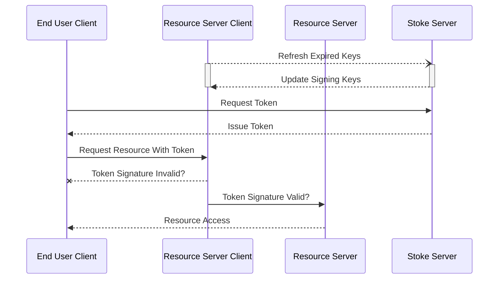
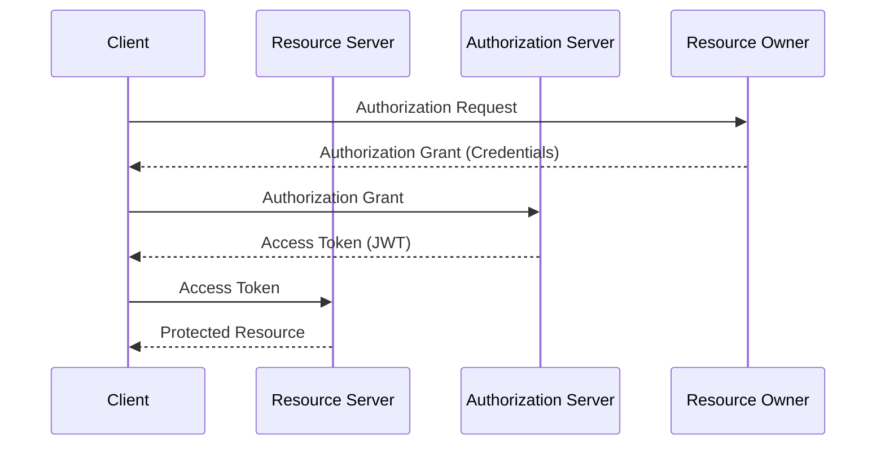
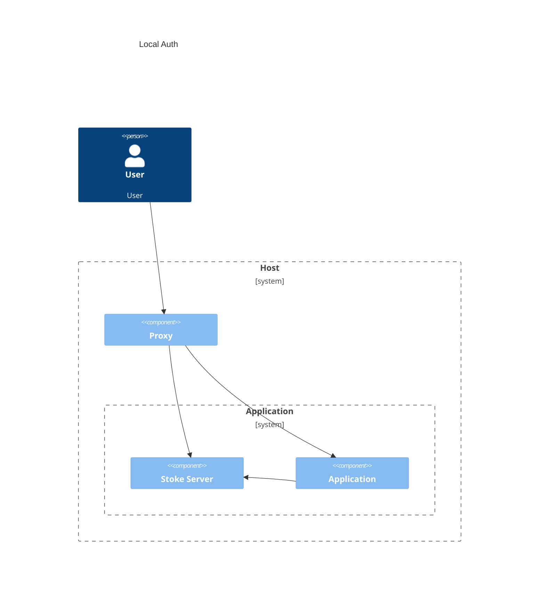
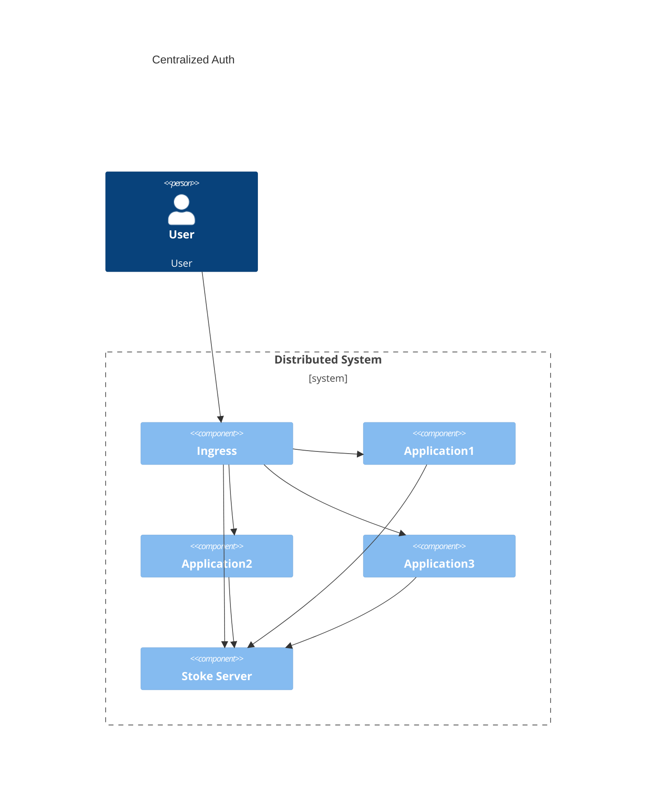

# <div align="center">  Stoke </div>
### <div align="center"> Lightweight Auth Server </div>


---

A drop in solution for application auth:
 * 🪶 Lightweight
 * 💀 Simple
 * 🔒 Secure

Features:
  * 🚀 Simple deployment
  * 🧰 HTTP client middleware for go and python *(more to come)*
  * 🔑 Automatic key rotation and distribution
  * 🔐 Configurable asymmetric key algorithm: ECDSA, EdDSA, or RSA 
  * ♻️ Refreshable Tokens
  * 🤹 Configurable credential sources
  * 👮‍♀️ Admin console

In simple single application environments, Stoke can be used as a drop in solution for authentication and authorization.
In more complex environments, Stoke can be used as the "last leg" of authentication to simplify an application's authentication implementation.

# Quick Start

1. Create a file named config.yaml with the following text:
``` yaml
---
server:
  port: 8080
  timeout: 1000

database:
  type: sqlite

  sqlite:
    file: stoke.db
    flags: "cache=shared&_fk=1"

logging:
  level: info
  pretty_stdout: true
  write_to_stdout: true

tokens:
  algorithm: ECDSA
  num_bits: 256

  persist_keys: true
  key_duration: 3h
  token_duration: 30m

  issuer: "stoke-1"

  user_info:
    full_name: "n"
    username: "u"
```

2. Start a stoke-auth server docker container with the config file mounted:
```
docker run -v $(pwd)/config.yaml:/etc/stoke/config.yaml --rm -it hpprdev/stoke-auth:0.1.0
```

3. The server will start and create a default admin user named `sadmin`. Find the line in the log with the password, it will look like:
```
2:09PM INF Created superuser 'sadmin' password=7ns3R7uR3dYAAtwbg5Vy7RPNm93hhmtDpFtrmCMSHvA=
```

4. Open a browser to http://localhost:8080/admin and log in as `sadmin` with the password that was generated in the log

# Releases

Releases are tagged commits in this repo and include versioned assets available on github and dockerhub.

Assets uploaded to github include the following for intel 64-bit processors:
  * A stoke-RELEASE-VER.tar.gz file with:
    * server executable file
    * A reference configuration file
    * Copy of the license file
  * md5sum of the tar.gz file

Docker images are uploaded to docker hub with a versioned tag i.e. 0.1.0.

Depending on the language, clients may have releases as well, but the source will be available on the tagged commit in the client directory.


# Clients

In the context of stoke, there are two types of clients:

 * Resource Server Clients
   * Clients that verify tokens and use claims information
 * End User Clients
   * Clients that are issued tokens 


<div align="center">
  <sub>Stoke Client Operation</sub>
</div>

## Resource Server Clients

Clients who wish to use the the generated JWTs as authorization may use the clients supplied in this repository.
This client code serves to cache public keys and verify tokens against them.
More information is available in the individual resource client libraries.

* golang
  * client source -- client/stoke
  * http example -- client/examples/go/engine
* python
  * HTTP Source client/pystokeauth
  * http (flask) example -- client/examples/python/weapons

## End User Clients

End user clients are those that request and make use of tokens issued by stoke to access resource servers.

End users are required to login with their registered username and password to receive a token.
That token can then be used as Authorization for any of the resource servers that are subscribed to the stoke server public keys.
For HTTP clients, Bearer Authorization is used and the Authorization header is set to `Bearer <TOKEN>`.

An example end user javascript implementation is included in `client/enduser/js`.

# Concepts

The stoke auth server is a simple implementation of the OAuth 2.0 protocol:

<div align="center">
  <sub>Annotated OAuth 2.0 Diagram from <a href="https://www.rfc-editor.org/rfc/rfc6749.html#section-1.2">RFC6749</a> </sub>
</div>

<br/><br/>
Stoke acts as a bridge between the authorization server and the resource owner.
The resource owner in the our case is the adminstrator of the server and/or an LDAP server.
The "Authorization Request" and "Authorization Grant" represent user credentials (username/password).
Admins log into the server and grant claims to users, then users may use their credentials to receive an access token.
This access token is a signed JWT that represents a verifiable permission on the Resource Server (microservice).

## Json Web Token (JWT)

A JWT is a base64 url encoded JSON string that represents permissions and information about a user.
JWTs are broken up into 3 base64 url encoded stanzas seperated by ".": the header, the body and the signature.

<table>
 <tr>
  <td>Part</td>
  <td>Description</td>
  <td>Example JSON</td>
  <td>Example URL Base64</td>
 </tr>
 <tr>
  <td> Header </td>
  <td> Specifies the algorithm and the type of the body. </td>
  <td> 
 
``` json 
{
  "alg": "PS256",
  "typ": "JWT"
}
```

  </td>
  <td>
   
```
   eyJhbGciOiJQUzI1NiIsInR5cCI6IkpXVCJ9
```

  </td>
 </tr>
 <tr>
  <td> Body </td>
  <td> Key value map of claims. Claims represent any information about a user, i.e. username, full name, permissions or group membership. </td>
  <td> 
 
``` json 
{
  "name": "John Doe",
  "role": "adm"
}
```

  </td>
  <td>
   
```
   eyJuYW1lIjoiSm9obiBEb2UiLCJyb2xlIjoiYWRtIn0
```

  </td>
 </tr>
  <tr>
  <td> Signature </td>
  <td> Cryptographic signature used to verify the token was isseed by trusted issuer </td>
  <td> N/A </td>
  <td>
   
```
   BEmnoqsSLGQxla8GE27cQVTcaifV5AGpamXph6WxNVs
```
  </td>
 </tr>
</table>

## Claim Groups and Claims

All user tokens include user information (username, email,etc.), timing information (expiration) and other custom claims.
Stoke admins give users custom claims by adding users to claim groups.
Users may have many claim groups and claim groups may have many claims.
If a user has a claim group assigned to them, all claims in that group will be included in tokens issued to that user.
If multiple claims with the same key are assigned they are joined using a comma.

For example the following user:
 * Username : stoke
 * First Name : Stephen
 * Last Name : Toke
 * Email: stoke@hppr.dev
 * Groups:
   * Admins
     * Claims:
       * Stoke Super User, stk=S
       * Ship Access, ship=acc
   * Log Users
     * Claims
       * Log Reader, log=r
       * Log Writer, log=w

Would receive the following custom claims in their tokens:
``` json
{
    "stk" : "S",
    "ship" : "acc",
    "log"  : "r,w"
}
```

Groups may also be linked to outside sources (LDAP, etc) to allow claims to automatically be populated by group membership.

A single group and claim to manage access to the admin console will be created automatically if it does not exist when server is started.
The claim that grants administrative access to the admin console is "stk=S".
In other words, if a user has `"stk" : "S"` in their token claims, they are able to access all admin pages.

The following claims are used for admin console access:
    * Monitoring access       - stk = m
    * Read all (no write)     - stk = s
    * Read stoke users        - stk = u
    * Read/Write stoke users  - stk = U
    * Read stoke groups       - stk = g
    * Read/Write stoke groups - stk = G
    * Read stoke claims       - stk = c
    * Read/Write stoke claims - stk = C

## Keys

Stoke only supports asymmetric token signing: RSA, ECDSA, and EdDSA.
Asymmetric signing algorithms require private and public keys.
Private keys are stored on the stoke server and are used to sign issued tokens.
Public keys are used to verify signatures produced by the private keys.
Public keys are available in JWK format from the /api/pkeys endpoint on the stoke server.
Clients must keep an up to date list of public keys to be able to verify tokens issued by the stoke server.

## RFCs

The following RFCs were used as reference:
 * JWT : https://datatracker.ietf.org/doc/rfc7519/
 * JWT Best Practices : https://datatracker.ietf.org/doc/rfc8725/
 * More work is needed to ensure these are being used
 * JWK : https://datatracker.ietf.org/doc/html/rfc7517
 * OAUTH 2.0 : https://datatracker.ietf.org/doc/rfc6749/

# In-depth Usage

### 1. Write the application

The first step to using stoke is to write an application.
Any application that makes use of JWT for auth should be able to use stoke, but web and grpc servers are the main type of server that stoke targets.

The applications most suited to use stoke are:

  * Web-based -- GRPC or HTTP
  * Written in Go or Python
      * Any language with a JWT library can be used, though custom client code is needed

### 2. Enumerate required permissions

The next step is to figure out what you would like to protect.
For model-based applications, this could be as simple as listing each of the operations, i.e. create, read, update, delete, for each model.
The stoke admin console is an example of a model-based application, where claims, groups and users are the models, and each model only has a read or write permission.
For more complex authorization schemes, this may take some thought to design user roles and permissions.

### 3. Create a claim scheme

Using the permissions enumerated in the last step, create a scheme to translate those permissions into JWT token claims.
These claims will be used to grant users the associated permissions.
If you would like to minimize the length of assigned tokens, it is advised to keep claim keys and values short.

There are multiple ways to create a claim scheme.
It depends on your needs which way you decide to layout the claims.

#### a. Single Claim

A single claim can be created that represents all of the users given permissions for a certain application.
Multiple claim values may be assigned to the same user, and the resulting claim will be a comma-seperated list of claim values.
For example, the stoke admin console uses a single claim, "stk", for all of it's permissions.
If a user is given permission to write user ("U") and read groups ("g") their tokens would be issued with "stk" : "U,g".

This way of creating a claim scheme allows applications to "own" a certain claim key.
Another application could potentially use these permissions for it's own authorization, though in that scenario a broader multiple claim permission scheme may be better suited.

#### b. Multiple Claim

In rare occasions, a multiple claim scheme may be appropriate.
A multiple claim scheme requires the enumeration and description of a wider variety of permissions that cross application boundaries.
Having multiple claims that your application cares about adds to the complexity of how it relates to the rest of the auth system.
A system that has multiple applications with well defined roles may be better suited to using multiple claims rather than one.

Using multiple claims in this way means that the system as a whole "owns" the claims, rather than a claim per application.

### 4. Augment application endpoints to require claims

Once the claim scheme has been created the application will need to be augmented to check tokens that have been sent with requests.
Each endpoint that requires a certain permission should require a token with the given claim.
This is where the Go and Python client libraries simplify things, though manual token claim checking is possible.
For example, the stoke admin console requires "stk":"U" claim to get to the CreateUser endpoint, so we add the stoke middleware to the CreateUser http handler.

### 5. Deploy and Configure Stoke Server to Issue Tokens

The last step is to deploy the stoke server and configure it to issue tokens with the appropriate claims.
Using the created claim scheme, you can create all of the claims and assign them to groups and then each user may be assigned any number of groups based on their required permissions.
Groups are where you can create roles based on a set of permissions.

# Building From Source

To build from source:
1. Install go 1.22, nodejs and npm
2. Clone this repository
3. Run `go mod tidy` to pull dependencies
4. Build the UI by running `npm install && npm run build --emptyOutDir` in the internal/admin/stoke-admin-ui directory
5. Build the server executable by running `go build -o stoke-server ./cmd/` in the root of the repository

# Configuration

Configuration files are in yaml and may be specified by using the `-config` flag.
By default, the executable looks for a config file named `config.yaml` in the running directory.

## Main Configuration file

There are 6 config sections:
 * server    -- web server options
 * database  -- user/groups/claims database connection options
 * logging   -- logging options
 * tokens    -- token/key generation/rotation options
 * telemetry -- where and how to send telemetry data
 * users     -- user source configuration (LDAP for now)

Here is an example config file will all possible configuration values:
```yaml
---
# Web Server configuration
server:
  address: ""                         # Address to listen on
  port: 8080                          # Port to listen on 
  timeout: 1000                       # Request timeout (milliseconds)
  tls_private_key: "" # stoke-private.key  # Private key to use for https TLS
  tls_public_cert: "" # stoke-public.crt   # Public key to use for https TLS
  disable_admin: false                # Disable the admin UI
  allowed_hosts:                      # Hosts to include in the allowed hosts CORS header
    - "*"

# Local database configuration
database:
  type: sqlite # Type of database to use ( sqlite, postgres or mysql )

  sqlite:
    file: stoke.db              # SQLite database file location
    flags: "cache=shared&_fk=1" # SQLite database flags

  postgres:
    host: 127.0.0.1    # Postgres server addres
    port: 5432         # Postgres server port
    database: "stoke"  # Postgres database name
    user: "stoke_user" # Postgres database user
    password: "pass"   # Postgres database password
    extra_args: ""     # Extra arguments to add at the end of the connection string

  mysql:
    host: 127.0.0.1    # Mysql server addres
    port: 3306         # Mysql server port
    database: "stoke"  # Mysql database name
    user: "stoke_user" # Mysql database user
    password: "pass"   # Mysql database password
    flags: ""          # Extra flags to add to the connection string

# Logging configuration
logging:
  level: debug           # Log level (trace, debug, info, error)
  log_file: ""           # Log file to write to. Creates if it does not exist.
  pretty_stdout: true    # Whether to prettify stdout logs
  write_to_stdout: true  # Whether to write to stdout at all

# Token generation and key rotation configuration
tokens:
  algorithm: ECDSA       # Algorithm to use for signing keys (ECDSA, EdDSA, or RSA)
  num_bits: 256          # Number of bits to use in the algorithm. Only applies for ECDSA or RSA (512, 384, or 256)

  persist_keys: true     # Whether to save private keys in the database
  key_duration: 3h       # How long signing keys are valid
  token_duration: 30m    # How long tokens are valid

  issuer: "stk"          # Issuer field in all tokens
  subject: ""            # Subject field in all tokens
  audience: []           # Audience field in all tokens
  include_issued_at: no  # Whether to set the issued at field in all tokens
  include_not_before: no # Whether to set the not before field in all tokens

  token_refresh_limit: 2      # Maximum number of refreshes per token. Set to 0 for unlimited
  token_refresh_count_key: "" # Claim to store the number of times token has been refreshed. Defaults to using the jti registered claim.

  user_info:       # Claim key configuration to store user information
    full_name: "n" # Token field to hold full name
    username: "u"  # Token field to hold username
    email: "e"     # Token field to hold email
    first_name: "" # Token field to hold first name
    last_name: ""  # Token field to hold last name

# OpenTelemetry Configuration
telemetry:
  trace_provider: grpc                      # Type of trace provider. (http or grpc)
  trace_export_url: https://localhost:4317  # Where to publish traces
  trace_insecure: true                      # Whether to use insecure transport to export traces

  metric_provider: none                     # Type of metric provider. (http, grpc, or none)
  metric_export_url: https://localhost:4317 # Where to publish traces
  metric_insecure: false                    # Whether to use insecure transport to export metrics

  disable_monitoring: true                  # Whether to disable the default /metrics and /metrics/logs endpoints
  require_prometheus_authentication: false  # Whether to require authentication to reach default prometheus metrics

# User Provider configuration
users:
  create_stoke_claims: true                 # Whether to create stoke administration claims for reading/writing claims/groups/users. Checked every start up.
  enable_ldap: true                         # Whether to use LDAP
  server_url: ldap://localhost:10389        # LDAP Server URL. Must begin with ldap://, ldaps:// or ldapi://

  bind_user_dn: "cn=admin,dc=planetexpress,dc=com" # Bind user distinguished name. Should only have read permissions
  bind_user_password: GoodNewsEveryone             # Password for user specified in bind_user_dn

  group_search_root: "ou=people,dc=planetexpress,dc=com"                 # Where to search in LDAP for groups
  group_filter_template: "(&(objectClass=group)(member={{ .UserDN }}))"  # Filter template to select groups. May use {{.UserDN}} or {{.Username}} to inject user info

  user_search_root: "ou=people,dc=planetexpress,dc=com"                       # Where to search in LDAP for users
  user_filter_template: "(&(objectClass=inetOrgPerson)(uid={{ .Username }}))" # Filter template to select users. Must return only one entry. May use {{.Username}} to inject user supplied username

  ldap_group_name_field: "cn"        # Field in LDAP groups which determines the group's name
  ldap_first_name_field: "givenName" # Field in LDAP user which determines the user's first name
  ldap_last_name_field:  "sn"        # Field in LDAP user which determines the user's last name
  ldap_email_field: "mail"           # Field in LDAP user which determines the user's email

  search_timeout: 0                   # LDAP search timeout. Set to 0 for unlimited.
  ldap_ca_cert: ""                    # Certificate to use when verifying connections to LDAP
  skip_certificate_verification: true # Whether to skip certificate verification for secure LDAP server
```

## Database Initialization file

A database initialization file can be specified using the `-dbinit` flag.
The database initialization file may add users, groups and claims to the database upon start up.
If you wish to only initialize the database without starting the server, run the executable with `migrate` subcommand.

The initialization file has 3 sections:
 * users
 * groups
 * claims

Note that all groups refrenced in the users and claims refrenced in groups must be created in this file to successfully initialize the database.

Here is an example dbinit.yaml file that initializes the database to have 2 users, 4 groups, and 4 claims:
``` yaml
# User information
# NOTE: All groups in the groups field MUST be defined in the top level groups section below
users:
  - username: tester
    first_name: Travis
    last_name: Ester
    email: tester@hppr.dev
    # Sets the tester user's password to tester (see below)
    password_hash: +OnrEsjkbdXdXugEKwDLGdqlDnMNV9+WyZ6T9wAtSMzp3jKYY+7pLYxoBlMlmWBOXlC9bviWtS9mw0fa4B6gkA==
    password_salt: H3UP6GzWV3UISU7HJN/sVT6YjTYcmOPdJwiFcdXMVyQ=
    groups:
      - Testing group

  - username: stoke
    first_name: Stephen
    last_name:  Toke
    email: stoke@hppr.dev
    # Sets the stokes user's password to admin
    password_hash: LY/qY1w8fE69kKL+2QCRv4YO8azlXaZtRFAKQz3yQd3QAdqjmyA+COUO2nZwrAvlTltXEAVqpbFYh1ptYRG9uQ==
    password_salt: y+hEP0tTMKmETwcJvDASwSoTKtJtA8Z6hDwp7rfLlUE=
    groups:
      - Stoke Admins

# Group information
# NOTE: All claims in the claims sections MUST be created in the top level claims section below
groups:
  - name: Stoke Admins
    description: Stoke administrators
    claims:
      - Stoke Super User

  - name: Testing group
    description: Group of testsers
    claims:
      - Testing Environment Access

  - name: Ship Crew
    description: Crew of the ship
    links:
      - ship_crew
    claims:
      - Ship Access
      - Inventory

  - name: Ship Admin Staff
    description: Ship Administrive staff
    links:
      - admin_staff
    claims:
      - Ship Access
      - Stoke Super User

# Claim information     
claims:
  - name: Stoke Super User
    description: Grants stoke admin super user priviledges
    short_name: stk
    value: S

  - name: Testing Environment Access
    description:  Grants access to the testing environment
    short_name: test
    value: acc

  - name: Ship Access
    description: Grants access to the ship
    short_name: ship
    value: acc

  - name: Inventory
    description: Grants inventory modification priviledges
    short_name: inv
    value: mod
```

If you wish to create a user with a specific password, use the `hash-password` subcommand that will ask for a password and hash.
It will output values to copy and paste into a dbinit file that will set the user's password hash and salt such that it matches when trying to log in.

## Server Executable

```
stoke-server [-config CONFIG_FILE] [-dbinit DBINIT_FILE] [SUBCOMMAND]
where SUBCOMMAND can be:
    - migrate       -- Migrate the configured database and exit
    - validate      -- Validate and print configuration and exit
    - hash-password -- Hash a password for use in a dbinit file
If SUBCOMMAND is ommited, the database is migrated and the server is run
```

# Use cases

## Local Auth

Stoke can be used as a local authentication server that is deployed as a companion container to an application.
This allows application developers to focus on developing their application and simply adding a stoke server when it is time to secure resources.
Another benefit to this approach is that it makes it easy to transition to a distributed architecture.



## Centralized Auth

A single central stoke server can supply tokens to multiple separate applications.
In this way, stoke can be used to supply authentication and authorization to a distributed system.



# HTTP Endpoints

A full openapi specification is available in internal/ent/openapi.json.

A summary is as follows:

- /admin -- the admin console (HTML)
- /api -- JSON api
  - /api/pkeys -- current valid public verification keys
  - /api/login -- JSON login
  - /api/renew -- renew a given JWT
  - /api/admin -- endpoints used from the admin console

# Road Map

    * High availablity
    * OpenID Connect User Provider
      * Stoke does not aim to become an OIDC Provider, but an OIDC Client.
      * The idea is to use OIDC much like LDAP, in that it will get the claim/auth data from a compliant OIDC server and use the data to do environment level auth.
    * Clients for additional languages/protocols
