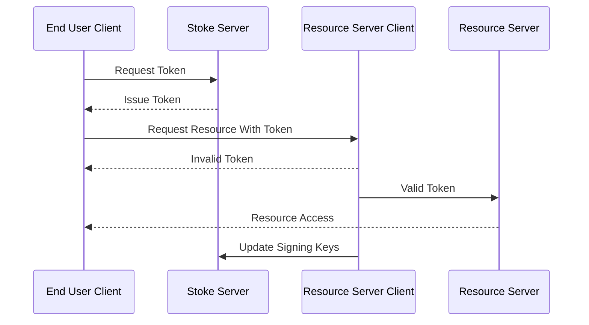

# <div align="center">  Stoke </div>
### <div align="center"> Lightweight Auth Server </div>


---

A drop in solution for microservice auth:
 * 🪶 Lightweight
 * 💀 Simple
 * 🔒 Secure

Features:
  * 🚀 Simple deployment
  * 🧰 HTTP client middleware for go and python *(more to come)*
  * 🔑 Automatic key rotation and distribution
  * 🔐 Configurable asymmetric key algorithm: ECDSA, EdDSA, or RSA 
  * ♻️ Refreshable Tokens
  * 🤹 Configurable credential sources
  * 👮‍♀️ Admin console

In simple single application environments, Stoke can be used as a drop in solution for authentication and authorization.
In more complex envrionments, Stoke can be used as the "last leg" of authentication to simplify a local authentication implementation.
For example in an Active Directory environment LDAP can be used as a user provider and Stoke can provide the access tokens to a set of services.

# Quick Start

1. Create a file named config.yaml with the following text:
``` yaml
---
server:
  port: 8080
  timeout: 1000

database:
  type: sqlite

  sqlite:
    file: stoke.db
    flags: "cache=shared&_fk=1"

logging:
  level: info
  pretty_stdout: true
  write_to_stdout: true

tokens:
  algorithm: ECDSA
  num_bits: 256

  persist_keys: true
  key_duration: 3h
  token_duration: 30m

  issuer: "stoke-1"

  user_info:
    full_name: "n"
    username: "u"
```

2. Start the docker file with the config file mounted:
```
docker run -v $(pwd)/config.yaml:/etc/stoke/config.yaml --rm -it hpprdev/stoke-auth:0.1.0
```

3. The server will start and create a default admin user named `sadmin`. Find the line in the log with the password, it will look like:
```
2:09PM INF Created superuser 'sadmin' password=7ns3R7uR3dYAAtwbg5Vy7RPNm93hhmtDpFtrmCMSHvA=
```

4. Open a browser to http://localhost:8080/admin and log in as `sadmin` with the password that was generated in the log

# Releases

Releases are tagged commits in this repo and include versioned assets available on github and dockerhub.

Assets uploaded to github are limited to include the following for intel 64-bit processors:
  * A stoke-RELEASE-VER.tar.gz file with:
    * server executable file
    * A reference configuration file
    * Copy of the license file
  * md5sum of the tar.gz file

Docker images are uploaded to docker hub with a versioned tag i.e. 0.1.0.

Depending on the language, clients may have releases as well, but the source will be available on the tagged commit in the client directory.

# Clients

In the context of stoke, there are two types of clients:

 * Resource Server Clients
   * Clients that verify tokens and use claims information
 * End User Clients
   * Clients that are issued tokens 


<div align="center">
  <sub>Stoke Client Operation</sub>
</div>

## Resource Server Clients

Clients who wish to use the the generated JWTs as authorization may use the clients supplied in this repository.
This client code serves to cache public keys and verify tokens against them.
More information is available in the individual resource client libraries.

* golang
  * client source -- client/stoke
  * http example -- client/examples/go/engine
* python
  * HTTP Source client/pystokeauth
  * http (flask) example -- client/examples/python/weapons

## End User Clients

End user clients are those that request and make use of tokens issued by stoke to access resource servers.

End users are required to login with their registered username and password to receive a token.
That token can then be used as Authorization for any of the resource servers that are subscribed to the stoke server public keys.
For HTTP clients, Bearer Authorization is used and the Authorization header is set to `Bearer <TOKEN>`.

An example end user javascript implementation is included in `client/enduser/js`.

# Concepts

The stoke auth server is a simple implementation of the OAuth 2.0 protocol:

<div align="center">
  <sub>Annotated OAuth 2.0 Diagram from <a href="https://www.rfc-editor.org/rfc/rfc6749.html#section-1.2">RFC6749</a> </sub>
</div>

<br/><br/>
Stoke acts as a bridge between the authorization server and the resource owner.
The resource owner in the our case is the adminstrator of the server and/or an LDAP server.
The "Authorization Request" and "Authorization Grant" represent user credentials (username/password).
Admins log into the server and grant claims to users, then users may use their credentials to receive an access token.
This access token is a signed JWT that represents a verifiable permission on the Resource Server (microservice).

## Json Web Token (JWT)

A JWT is a base64 url encoded JSON string that represents permissions and information about a user.
JWTs are broken up into 3 base64 url encoded stanzas seperated by ".": the header, the body and the signature.

<table>
 <tr>
  <td>Part</td>
  <td>Description</td>
  <td>Example JSON</td>
  <td>Example URL Base64</td>
 </tr>
 <tr>
  <td> Header </td>
  <td> Specifies the algorithm and the type of the body. </td>
  <td> 
 
``` json 
{
  "alg": "PS256",
  "typ": "JWT"
}
```

  </td>
  <td>
   
```
   eyJhbGciOiJQUzI1NiIsInR5cCI6IkpXVCJ9
```

  </td>
 </tr>
 <tr>
  <td> Body </td>
  <td> Key value map of claims. Claims represent any information about a user, i.e. username, full name, permissions or group membership. </td>
  <td> 
 
``` json 
{
  "name": "John Doe",
  "role": "adm"
}
```

  </td>
  <td>
   
```
   eyJuYW1lIjoiSm9obiBEb2UiLCJyb2xlIjoiYWRtIn0
```

  </td>
 </tr>
  <tr>
  <td> Signature </td>
  <td> Cryptographic signature used to verify the token was isseed by trusted issuer </td>
  <td> N/A </td>
  <td>
   
```
   BEmnoqsSLGQxla8GE27cQVTcaifV5AGpamXph6WxNVs
```
  </td>
 </tr>
</table>

## Claim Groups and Claims

All user tokens include user information (username, email,etc.), timing information (expiration) and other custom claims.
Stoke admins give users custom claims by adding users to claim groups.
Users may have many claim groups and claim groups may have many claims.
If a user has a claim group assigned to them, all claims in that group will be included in tokens issued to that user.

For example the following user:
 * Username : stoke
 * First Name : Stephen
 * Last Name : Toke
 * Email: stoke@hppr.dev
 * Groups:
   * Admins
     * Claims:
       * Stoke Super User, srol=spr
       * Ship Access, ship=acc
   * Log Users
     * Claims
       * Log Reader/Writer, log=r,w

Would receive the following custom claims in their tokens:
``` json
{
    "srol" : "spr",
    "ship" : "acc",
    "log"  : "r,w"
}
```

Groups may also be linked to outside sources (LDAP, etc) to allow claims to automatically be populated by group membership.

A single group and claim to manage access to the admin console will be created automatically if it does not exist when server is started.
The claim that grants administrative access to the admin console is "srol=spr".
In other words, if a user has `"srol" : "spr"` in their token claims, they are able to access the admin pages.

## Keys

Stoke only supports asymmetric token signing: RSA, ECDSA, and EdDSA.
Asymmetric signing algorithms require private and public keys.
Private keys are stored on the stoke server and are used to sign issued tokens.
Public keys are used to verify signatures produced by the private keys.
Public keys are available in JWK format from the /api/pkeys endpoint on the stoke server.
Clients must keep an up to date list of public keys to be able to verify tokens issued by the stoke server.

## RFCs

The following RFCs were used as reference:
 * JWT : https://datatracker.ietf.org/doc/rfc7519/
 * JWT Best Practices : https://datatracker.ietf.org/doc/rfc8725/
 * More work is needed to ensure these are being used
 * JWK : https://datatracker.ietf.org/doc/html/rfc7517
 * OAUTH 2.0 : https://datatracker.ietf.org/doc/rfc6749/

# Building From Source

To build from source:
1. Install go 1.22, nodejs and npm
2. Clone this repository
3. Run `go mod tidy` to pull dependencies
4. Build the UI by running `npm install && npm run build --emptyOutDir` in the internal/admin/stoke-admin-ui directory
5. Build the server executable by running `go build -o stoke-server ./cmd/` in the root of the repository

# Configuration

Configuration files are in yaml and may be specified by using the `-config` flag.
By default, the executable looks for a config file named `config.yaml` in the running directory.

## Main Configuration file

An example configuration file that has all of the available options is available in cmd/config.yaml.

There are 6 config sections:
 * server    -- web server options
 * database  -- user/groups/claims database connection options
 * logging   -- logging options
 * tokens    -- token/key generation/rotation options
 * telemetry -- where and how to send telemetry data
 * users     -- user source configuration (LDAP for now)

## Database Initialization file

A database initialization file can be specified using the `-dbinit` flag.
The database initialization file may add users, groups and claims to the database upon start up.
If you wish to only initialize the database without starting the server, run the executable with `migrate` subcommand.

The initialization file has 3 sections:
 * users
 * groups
 * claims

Note that all groups refrenced in the users and claims refrenced in groups must be created in this file to successfully initialize the database.

An example initialization file is available in cmd/dbinit.yaml.
It creates a super user named `stoke` with a password of `admin`.

If you wish to create a user with a specific password, use the `hash-password` subcommand that will ask for a password and hash.
It will output values to copy and paste into a dbinit file that will set the user's password hash and salt such that it matches when trying to log in.

## Server Executable

```
stoke-server [-config CONFIG_FILE] [-dbinit DBINIT_FILE] [SUBCOMMAND]
where SUBCOMMAND can be:
    - migrate       -- Migrate the configured database and exit
    - validate      -- Validate and print configuration and exit
    - hash-password -- Hash a password for use in a dbinit file
If SUBCOMMAND is ommited, the database is migrated and the server is run
```


# HTTP Endpoints

A full openapi specification is available in internal/ent/openapi.json.

A summary is as follows:

- /admin -- the admin console (HTML)
- /api -- JSON api
  - /api/pkeys -- current valid public verification keys
  - /api/login -- JSON login
  - /api/renew -- renew a given JWT
  - /api/admin -- endpoints used from the admin console

# Road Map

    * High availablity
    * OpenID Connect User Provider
      * Stoke does not aim to become an OIDC Provider, but an OIDC Client.
      * The idea is to use OIDC much like LDAP, in that it will get the claim/auth data from a compliant OIDC server and use the data to do environment level auth.
    * Clients for additional languages/protocols
