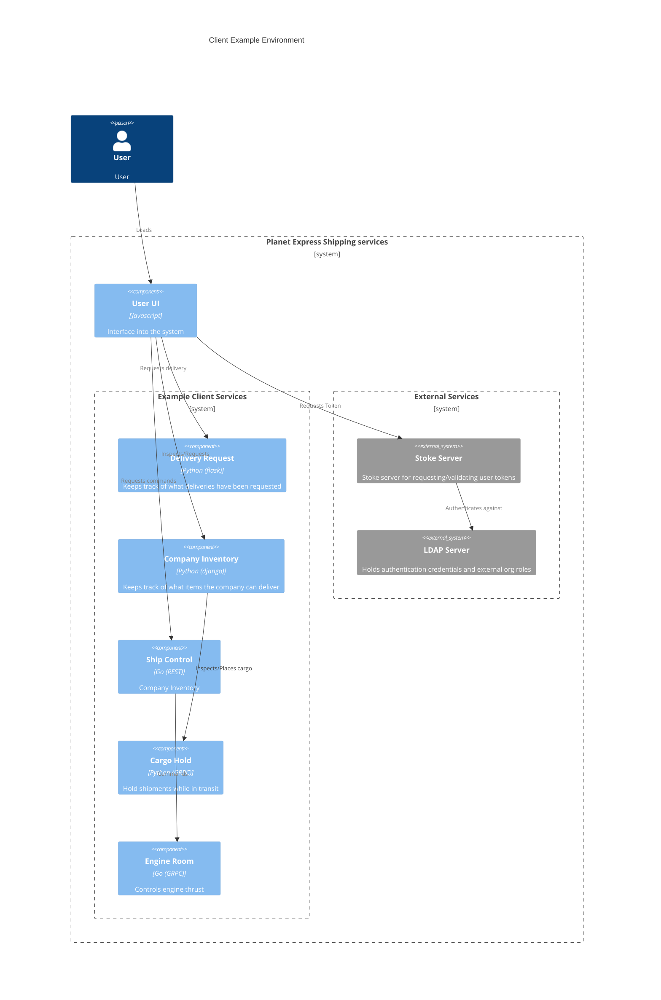

# Stoke Client Examples

This directory contains examples clients demonstrating stoke clients.

The test environment is a simulation of a space delivery shipment service with the following components:
  * User UI
      * Javascript
      * User Login
      * Request Delivery -- customer role
      * Transfer Cargo -- staff role
      * Inspect ship status -- crew role
      * Inspect Cargo -- crew role
      * Change ship speed -- engineer role
  * Company Inventory
      * Python REST client (django)
      * Keeps track of what items the company can deliver
      * Transfer cargo -- staff role
  * Delivery Request
      * Python REST client (flask)
      * Keeps track of what deliveries have been requested
      * Request delivery -- customer role
  * Ship Control
      * Go REST client
      * Commands or inspects ship
      * Inspect ship status -- crew role
  * Engine
      * Go GRPC client
      * Controls engine thrust
      * Change ship speed -- engineer role
  * Cargo Hold
      * Python GRPC client
      * Hold shipments while in transit
      * Inspect Cargo -- crew role
   
*This is contrived example. The architecture here does not constitute advice*
